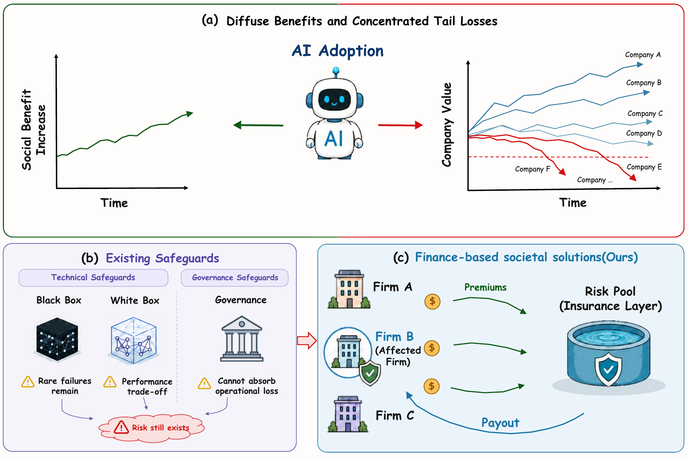

<div align="center">

# Insurance as AI Risk Infrastructure

### A generative-agent simulation of enterprise AI adoption, operational tail risk, and insurance-mediated risk transfer

[](https://github.com/yxyuan-joy/Insurance-as-AI-Risk-Infrastructure/actions/workflows/tests.yml)
[](https://www.python.org/)

[Overview](#overview) | [Framework](#framework) | [Quick Start](#quick-start) | [Experiments](#experiments) | [Data](#data) | [Documentation](#documentation)

</div>

<p align="center">
  
</p>

## Overview

Enterprise AI can create broad productivity gains while exposing individual firms to infrequent but financially concentrated operational losses. **Insurance as AI Risk Infrastructure** is a computational framework for studying whether market-based risk transfer can absorb these losses and support more stable AI adoption.

The LLM-driven agent-based social simulation (LABSS) combines model-generated firm decisions with AI vendor competition, insurance pricing and negotiation, contractual lock-in, claim settlement, experience memory, network panic transmission, and explicit balance-sheet accounting. Operational-risk evidence is supplied by AutoCLAW, which executes and verifies enterprise tasks in isolated workspaces before converting the observed incidents into a simulation-ready firm-level risk panel.

The formal design evaluates matched societies with and without access to AI-risk insurance. The insurance condition is changed through a single market switch; firm profiles, vendor conditions, operational-risk inputs, model settings, network structure, and random seeds remain aligned across the paired runs.

## Framework

| Layer | What is modeled |
|---|---|
| Operational evidence | AutoCLAW task execution, deterministic verification, incident severity, and loss signals |
| Firm behavior | AI adoption, vendor choice and renewal, insurance purchase and renewal, negotiation, and abandonment |
| Market institutions | Four heterogeneous AI vendors, four private insurer archetypes, and a residual backstop facility |
| Dynamic state | Contracts, cash flows, AI productivity, operational losses, claims, memory, panic, and peer exposure |
| Aggregate accounting | Firm and institutional capital, insurance coverage, adoption, claims, and bankruptcy dynamics |
| Counterfactual design | Matched insurance-enabled and insurance-disabled societies under common inputs and seeds |

### Simulation setting

- **Agents:** 300 heterogeneous buyer firms distributed across 11 GICS-aligned sectors.
- **Market participants:** four AI vendors and four private insurers, with a residual risk facility available under constrained market conditions.
- **Time:** 100 operational updates, each representing three calendar days, corresponding to a 300-day horizon.
- **Behavior:** model-generated decisions use firm traits, bounded market visibility, contract state, prior experience, peer conditions, and current financial constraints.
- **Risk transmission:** realized incidents affect cash, experience memory, panic, neighboring firms, insurance demand, and subsequent AI decisions.
- **Accounting:** premiums, vendor fees, refunds, indemnities, operational losses, and bankruptcies are settled explicitly rather than inferred from adoption rates.

The complete formal specification is frozen in [`configs/formal.yaml`](configs/formal.yaml). The YAML file, rather than the summary above, is authoritative for all parameter values.

## Repository Structure

```text
.
|-- src/action_risk_v2/    Core simulation, decision, contract, insurance, and accounting logic
|-- configs/               Formal, rule-based ABM, and one-factor sensitivity configurations
|-- autoclaw/              Enterprise-task generation, verification, and risk-panel preparation
|-- analysis/              Result summaries, trace audits, and manuscript-figure generation
|-- scripts/               Data, testing, and experiment launchers
|-- tests/                 Unit and mechanism tests with a generated synthetic fixture
|-- docs/                  Detailed reproducibility and implementation documentation
|-- assets/                Repository artwork
`-- run_simulation.py      Main simulator entry point
```

## Quick Start

### 1. Install

Python 3.10 or later is required.

```bash
git clone https://github.com/yxyuan-joy/Insurance-as-AI-Risk-Infrastructure.git
cd Insurance-as-AI-Risk-Infrastructure

python3 -m venv .venv
source .venv/bin/activate
python -m pip install --upgrade pip
python -m pip install -e ".[analysis,test]"
```

### 2. Verify the implementation

The test suite requires neither research data nor a model endpoint. It creates a small deterministic fixture in the ignored `.test-data/` directory.

```bash
bash scripts/run_smoke.sh
```

The tests cover data boundaries, bounded vendor visibility, decision schemas, contract lifecycle, insurance pricing, negotiations, claim settlement, bankruptcy ordering, memory, panic propagation, network context, checkpoint recovery, and AutoCLAW panel construction.

### 3. Download and validate the inputs

Research inputs are distributed through the companion [Hugging Face dataset](https://huggingface.co/datasets/yxyuan-joy/Insurance-as-AI-Risk-Infrastructure-Data).

```bash
python scripts/download_data.py
python scripts/validate_data.py
```

The downloader preserves the `data/` layout expected by the frozen configurations. The directory is ignored by Git so the code and data releases remain separate.

## Experiments

### Rule-based ABM comparison

The deterministic comparison retains the same firms, markets, contracts, accounting, risk mapping, and time horizon. The generative decision layer is replaced by documented score and threshold rules, so this experiment does not require an LLM service.

```bash
bash scripts/run_rule_abm.sh
```

### Formal LABSS experiment

Formal runs require one or more OpenAI-compatible model endpoints. A paired launcher runs the insurance-enabled society and its insurance-disabled counterfactual for the same seed:

```bash
bash scripts/run_formal_pair.sh 42
```

The launcher reads model endpoints from `VLLM_BASE_URLS` and the served model name from `VLLM_MODEL`; no machine-specific address is embedded in the repository. Use `scripts/run_formal_seeds.sh` for the frozen seeds 42, 77, and 202. Deployment and resume instructions are provided in the [cluster execution guide](docs/CLUSTER_EXECUTION.md).

### Sensitivity analysis

Fourteen one-factor profiles vary AI loss, AI value, insurance price, insurance protection, network density, panic transmission, and memory persistence around the formal configuration.

```bash
bash scripts/run_sensitivity_pair.sh ai_loss_high 42
```

Available profiles are stored in [`configs/sensitivity/`](configs/sensitivity). Each launcher preserves the matched insurance comparison and writes newly generated trajectories under `runs/`.

### Configuration matrix

| Configuration | Decision layer | Insurance comparison | Purpose |
|---|---|---|---|
| [`configs/formal.yaml`](configs/formal.yaml) | LLM agents | Enabled and disabled pair | Main experiment |
| [`configs/rule_abm.yaml`](configs/rule_abm.yaml) | Deterministic heuristic | Inherits the formal market | Rule-based ABM comparison |
| [`configs/sensitivity/`](configs/sensitivity) | LLM agents | Enabled and disabled pair | One-factor robustness analysis |

## Data

The companion dataset contains the inputs consumed by the released configurations:

| Input | Scale | Role |
|---|---:|---|
| Simulated firm population | 300 firms | Financial and behavioral initialization |
| Firm-update operational-risk panel | 30,000 rows | Firm-level incidents, severity, losses, and risk scores |
| Industry-update risk panel | 1,100 rows | Sector-level risk context across 100 updates |
| Firm selection and quality records | 300 firms plus audit summaries | Identifier alignment, task coverage, and provenance checks |

The data describe simulated firms and sandboxed enterprise tasks. They do not contain observed individuals, confidential company records, or simulation outcomes. Field definitions and missing-data treatment are documented in [`docs/DATA_DICTIONARY.md`](docs/DATA_DICTIONARY.md) and in the dataset card.

## Outputs and Analysis

Runs are written below `runs/` by default. A completed run contains firm, market, insurer, event, checkpoint, and model-decision records that can be audited independently.

```bash
# Recompute compact summaries from locally generated runs
python analysis/summarize_results.py \
  --formal-dir runs/formal \
  --rule-dir runs/rule_abm

# Audit model backends, parsing, and conservative recovery records
python analysis/audit_model_traces.py \
  --formal-dir runs/formal
```

The repository does not include precomputed trajectories or manuscript results. They are generated locally from the released code, frozen configurations, and companion inputs.

## Documentation

| Document | Contents |
|---|---|
| [Reproducibility guide](docs/REPRODUCIBILITY.md) | Complete environment, data, experiment, analysis, and AutoCLAW workflow |
| [Simulator reference](docs/SIMULATOR.md) | Entry points and source-module responsibilities |
| [Configuration reference](docs/CONFIGURATION.md) | Formal blocks, counterfactual switch, baseline, and sensitivity profiles |
| [Data dictionary](docs/DATA_DICTIONARY.md) | Input files, fields, dimensions, and validation rules |
| [Prompt index](docs/PROMPTS.md) | Decision and negotiation inputs, response schemas, and trace policy |
| [Cluster execution](docs/CLUSTER_EXECUTION.md) | Model-serving, launch, resume, and output conventions |
| [Release scope](docs/RELEASE_SCOPE.md) | Boundary between code, input data, and locally generated artifacts |

## Release Scope

This GitHub repository contains executable code, frozen configurations, tests, launchers, analysis utilities, and documentation. The companion Hugging Face repository contains only research input data. Simulation trajectories, calibration runs, model traces, checkpoints, manuscript result figures, and reported results are not distributed in either release.

## Citation

If you use this artifact, please cite the companion manuscript:

> *Insurance as AI Risk Infrastructure: A Generative-Agent Simulation of AI Adoption* (2026).

Full citation metadata will be added when the manuscript record becomes publicly available.

## License

Copyright (c) 2026 The Authors. The code is provided under the scholarly peer-review and reproducibility terms in [`LICENSE`](LICENSE). It is not released under a standard open-source license.
